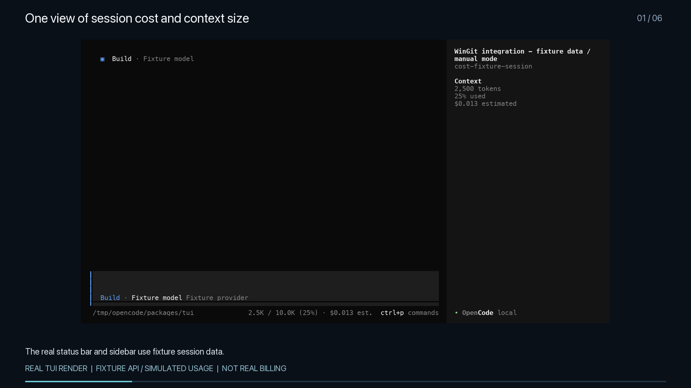
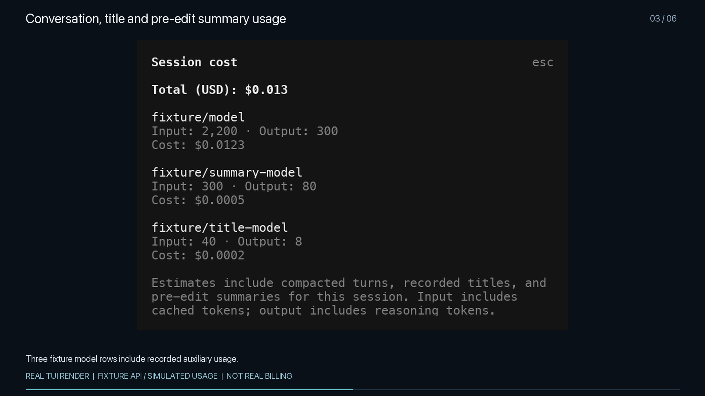
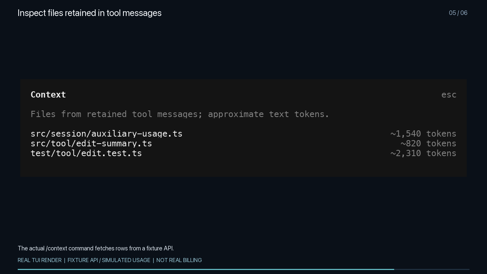
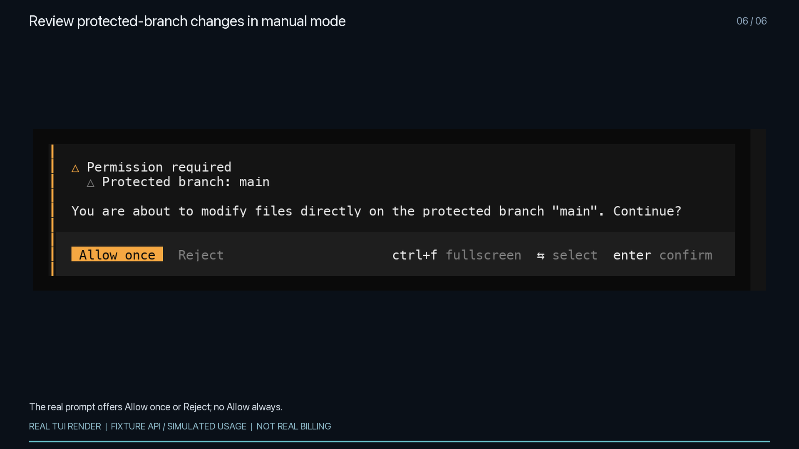

# WinGit integration UI evidence

[Watch or download the 40-second UI replay](WinGit-integrated-TUI-demo.mp4).

These images and the video use the production App and OpenTUI renderer at commit `900b16c1d42ee9b14f6e6b83832a270b4313646a`, with fixture API responses and simulated usage events. The capture test passed one test with six assertions. The subsequent changes only remove test whitespace and clarify automatic approval in documentation.

The video replays six captured UI states. It shows the meter and cost together, conversation/title/summary cost rows, a live cost update, `/context`, and protected-branch confirmation in manual mode. It does not run a model request or an edit. It does not validate billing, backend persistence or the result of rejecting a write. Separate backend and TUI tests cover those implementation paths; the real provider billing comparison remains open.

All frames identify the fixture data. Automatic approval mode is not demonstrated.

## Meter and session cost

## Conversation and auxiliary costs

## Retained file context

## Protected branch confirmation

